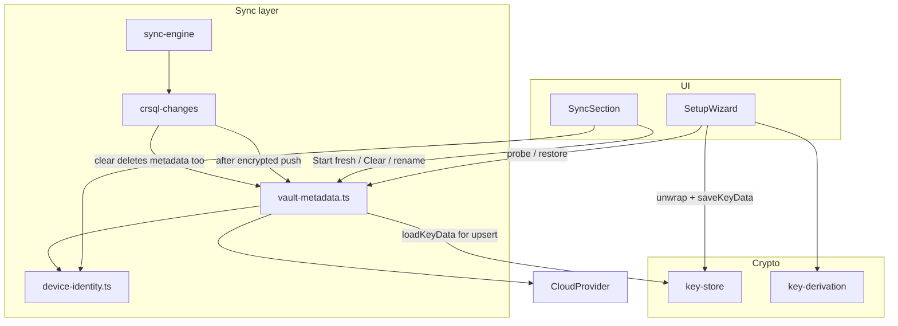

# Cloud Vault Metadata Design

**Spec**: `.specs/features/cloud-vault-metadata/spec.md`  
**Context**: `.specs/features/cloud-vault-metadata/context.md`  
**Status**: Approved  
**Approach**: Option 1 — Sync sidecar module (confirmed)

---

## Architecture Overview

A provider-agnostic sidecar owns the well-known vault-metadata file. Segment push/pull stay in `crsql-changes.ts`; the sidecar is called from `pushDeltas` / `clearRemoteChangeSegments` and from Setup/Settings for probe → restore / start-fresh. Google Drive and WebDAV need no API changes (AD-003).



```text
Encrypted push (dek != null)
  → upload changes-<site>-N.bin (if new rows)
  → upsert vault-metadata.json (always; refresh registry + key material)

Setup with provider
  → probeRemoteVault()
      empty            → allow Create
      ready            → Restore primary; block Create
      legacy           → block Restore + Create; offer Clear / Start fresh
      corrupt          → restore-blocking; offer Clear / Start fresh

Restore
  → download metadata → deriveKek → unwrapDek → saveKeyData → unlock
  → wrong passphrase / download failure: no local writes

Start fresh / Clear
  → delete changes-*.bin + vault-metadata.json → clearSyncState
  → Start fresh also clearKeyData → route to Create
```

---

## Code Reuse Analysis

### Existing Components to Leverage

| Component | Location | How to Use |
| --------- | -------- | ---------- |
| `CloudProvider` | `src/sync/cloud-provider.ts` | `upload` / `download` / `list` / `delete` — no interface change |
| `pushDeltas` / `clearRemoteChangeSegments` | `src/sync/crsql-changes.ts` | Hook metadata upsert + extend clear |
| `pushChanges` / `clearCloudSyncData` | `src/sync/sync-engine.ts` | Thin re-exports; Start fresh builds on clear |
| `KeyData` / `saveKeyData` / `loadKeyData` / `clearKeyData` | `src/crypto/key-store.ts` | Source for upsert; target for restore; wipe on Start fresh |
| `deriveKek` / `unwrapDek` / `wrapDek` | `src/crypto/key-derivation.ts` | Restore unwrap; iterations already on `KeyData` |
| Base64 helpers | `src/sync/crsql-changes.ts` (or extract) | Encode `wrappedDek` / `salt` in JSON |
| `getSiteId` | `src/sync/crsql-changes.ts` | Registry key |
| `createMockCloudProvider` | `src/sync/mock-cloud-provider.ts` | Unit tests for probe / upsert / clear |
| `resolveActiveProvider` | `src/sync/active-provider.ts` | Setup Restore needs a configured provider |
| `SetupWizard` / `SyncSection` | `src/ui/pages/SetupWizard.tsx`, `src/ui/components/SyncSection.tsx` | Restore / guards / Start fresh / device rename UI |
| `PassphraseInput` | `src/ui/components/PassphraseInput.tsx` | Restore passphrase step |

### Integration Points

| System | Integration Method |
| ------ | ------------------ |
| Delta sync | After encrypted push path, call `upsertVaultMetadata` |
| Clear cloud | Delete `vault-metadata.json` in addition to `changes-*.bin` |
| Auto-sync | No API change — uses `pushChanges`; inherits metadata upsert when `dek` set |
| Onboarding | SetupWizard gains remote probe + Restore; Create gated on probe result |
| Settings | Device rename + Start fresh; Clear already present, extended behavior |

---

## Components

### `vault-metadata.ts` (new)

- **Purpose**: Encode/decode, probe, upsert, download, and delete the cloud vault-metadata file.
- **Location**: `src/sync/vault-metadata.ts`
- **Interfaces**:
  - `VAULT_METADATA_FILENAME = 'vault-metadata.json'`
  - `parseVaultMetadata(bytes: Uint8Array): VaultMetadata` — throws if corrupt / missing required fields
  - `serializeVaultMetadata(meta: VaultMetadata): Uint8Array`
  - `probeRemoteVault(provider: CloudProvider): Promise<RemoteVaultStatus>`
  - `downloadVaultMetadata(provider: CloudProvider): Promise<VaultMetadata>`
  - `upsertVaultMetadata(provider, args: UpsertVaultMetadataArgs): Promise<void>` — download-merge-upload (or create); updates this `siteId` registry entry; sets wrapped key fields from local `KeyData`
  - `deleteVaultMetadata(provider: CloudProvider): Promise<boolean>` — true if a file was deleted
- **Dependencies**: `CloudProvider`, `KeyData`, device label helpers
- **Reuses**: Provider list/download/upload/delete; same folder as segments

### `device-identity.ts` (new)

- **Purpose**: Auto-generate and persist the local device display label.
- **Location**: `src/sync/device-identity.ts`
- **Interfaces**:
  - `detectBrowserId(): string` — coarse browser name from `navigator.userAgentData` / UA
  - `generateDefaultDeviceLabel(): string` — e.g. `Chrome · Windows` / `Chrome · Android`
  - `getDeviceLabel(): Promise<string>` — custom if set, else default (lazy-persist default optional)
  - `setDeviceLabel(label: string): Promise<void>` — trim; reject empty; max 64 chars
- **Dependencies**: IndexedDB (prefer existing sync-state or sync-config store — design picks one small key, e.g. in sync-state)
- **Reuses**: Same IDB patterns as `sync-state.ts`

### `crsql-changes.ts` (extend)

- **Purpose**: Keep delta sync; call metadata sidecar on encrypted push and clear.
- **Changes**:
  - `pushDeltas`: when `dek != null`, after segment upload logic (including no-op watermark path), call `upsertVaultMetadata` with `loadKeyData()`, `getSiteId`, device label. If `loadKeyData()` is null while `dek` is set, skip metadata and treat as internal inconsistency (log / sync error — should not happen in normal unlock path).
  - IF upsert throws after segments uploaded THEN rethrow as sync error (CVM-05); next encrypted push retries upsert.
  - `clearRemoteChangeSegments`: also `deleteVaultMetadata` (or delete by filename while listing); return count may include metadata file or document segment-only count + metadata deleted separately — prefer total remote files deleted for Settings copy clarity.
- **Reuses**: Existing segment parse/list/delete loop

### `sync-engine.ts` (extend)

- **Purpose**: Public sync API used by UI / auto-sync.
- **Interfaces**:
  - Re-export or wrap `probeRemoteVault`, `restore` helper if kept here
  - `clearCloudSyncData` — unchanged signature; behavior includes metadata delete via deltas
  - `startFreshVault(provider): Promise<void>` — `clearCloudSyncData` + `clearKeyData`; caller routes to Setup Create
- **Reuses**: Existing clear + key-store clear

### `restoreVaultFromRemote` (new helper — in `vault-metadata.ts` or `sync-engine.ts`)

- **Purpose**: Single function for Restore success path without UI.
- **Interfaces**:
  - `restoreVaultFromRemote(provider, passphrase): Promise<CryptoKey>` — download → parse → `deriveKek` → `unwrapDek` → `saveKeyData` only after successful unwrap → return DEK for `unlock`
- **Failure**: incorrect passphrase or corrupt metadata → throw; no `saveKeyData`

### `SetupWizard.tsx` (extend)

- **Purpose**: Offer Restore; gate Create on `RemoteVaultStatus`.
- **Flow**:
  1. After welcome / on choice: if no provider configured, Restore CTA prompts connect-cloud first (reuse provider connect patterns from SyncSection / active-provider).
  2. With provider: `probeRemoteVault`.
  3. `ready` → primary **Restore existing vault** (passphrase step); Create disabled with explanation.
  4. `legacy` / `corrupt` → message + Clear / Start fresh; Create disabled.
  5. `empty` → existing Create / skip paths.
- **Reuses**: `PassphraseInput`, `unlock` from `useVault`

### `SyncSection.tsx` (extend)

- **Purpose**: Start fresh, device rename, optional device registry list, clearer clear copy.
- **Changes**:
  - **Start fresh vault** confirm → `startFreshVault` → navigate/reload into Setup Create
  - **Clear cloud sync data** already calls `clearCloudSyncData` (now deletes metadata too)
  - Device label field (P2) bound to `getDeviceLabel` / `setDeviceLabel`
  - Known devices list (P2) from last downloaded/cached metadata or probe
- **Peer attribution (P2)**: where pull/sync errors mention `peer site <id>`, resolve label via registry when available

---

## Data Models

### `VaultMetadata` (cloud JSON file `vault-metadata.json`)

```typescript
type VaultDeviceEntry = {
  readonly label: string;
  readonly browser: string;
  readonly lastSeenAt: string; // ISO-8601
};

type VaultMetadata = {
  readonly version: 1;
  readonly wrappedDek: string; // base64
  readonly salt: string; // base64
  readonly iterations: number;
  readonly devices: Readonly<Record<string, VaultDeviceEntry>>; // key = crsql site id hex
};
```

**Relationships**: `wrappedDek` / `salt` / `iterations` mirror local `KeyData`. `devices[siteId]` attributes `changes-<siteId>-*.bin` writers.

### `RemoteVaultStatus`

```typescript
type RemoteVaultStatus =
  | { readonly kind: 'empty' }
  | { readonly kind: 'ready'; readonly metadata: VaultMetadata }
  | { readonly kind: 'legacy'; readonly segmentCount: number }
  | { readonly kind: 'corrupt'; readonly reason: string };
```

**Probe rules**:
- metadata present + parses → `ready`
- metadata present + parse/required-field failure → `corrupt`
- no metadata + ≥1 `changes-*.bin` → `legacy`
- no metadata + no segments → `empty`

### Local device label

Stored as a single string key in the existing sync-state (or sync-config) IndexedDB database — not in the cloud file until the next encrypted push merges it into `devices[siteId].label`.

---

## Error Handling Strategy

| Error Scenario | Handling | User Impact |
| -------------- | -------- | ----------- |
| Wrong restore passphrase | `unwrapDek` throws; no `saveKeyData` | Clear error; stay on Restore |
| Metadata download null / network fail on restore | Abort before key writes | Recoverable error; retry |
| Corrupt / incomplete metadata JSON | `corrupt` status or restore throw | Offer Clear / Start fresh; no Create-over |
| Metadata upsert fails after segment upload | Propagate sync error; segments may already exist | User sees sync failed; next encrypted push retries upsert |
| Clear / Start fresh partial network failure | Do not route to Create until probe shows metadata absent (re-probe after clear) | Error + stay put |
| Encrypted push with `dek` but no `KeyData` | Skip or fail upsert explicitly | Should not occur if unlock path consistent |
| Unencrypted push (`dek` null) | No metadata read/write | Legacy local-only behavior unchanged |
| Restore with no provider | Prompt connect provider first | Cannot restore until connected |

---

## Risks & Concerns

| Concern | Location | Impact | Mitigation |
| ------- | -------- | ------ | ---------- |
| Setup today never talks to cloud before Create | `SetupWizard.tsx` | Restore unreachable without new connect step | Add connect-provider gate before Restore; reuse `resolveActiveProvider` / SyncSection connect UX |
| `pushDeltas` early-return when no new rows | `crsql-changes.ts:181` | Metadata never written if user only pulls | Upsert metadata whenever `pushDeltas`/`pushChanges` runs with `dek`, even on segment no-op |
| `clearRemoteChangeSegments` only deletes `changes-*` | `crsql-changes.ts:273` | Orphan vault-metadata after “clear” | Extend clear to delete metadata filename |
| Wrapped DEK in Drive `appDataFolder` | new metadata file | Anyone with Google account + app OAuth can download ciphertext of wrapped key | Acceptable and intentional (passphrase still required); same trust model as encrypted segments |
| First-writer race (two empty devices) | probe at decision time | Last upsert wins key material | Documented; loser must Restore or Start fresh (spec edge case) |
| Pull error strings only show raw site id | `crsql-changes.ts:232` | Weak device attribution until P2 | P2 maps site id → registry label when metadata available |
| Test gap: no restore/setup cloud tests today | SetupWizard largely UI | Regressions in probe/restore | Unit-test sidecar heavily with mock provider; add focused restore helper tests |

---

## Tech Decisions

| Decision | Choice | Rationale |
| -------- | ------ | --------- |
| Architecture | Sync sidecar (`vault-metadata.ts`) | Confirmed Option 1; minimal churn, AD-003-friendly |
| Filename | `vault-metadata.json` | Readable, stable, easy to spot in provider listings / tests |
| Schema version | `version: 1` literal | Allows future rotation without silent mis-parse |
| Binary fields in JSON | Standard base64 strings | Matches existing sync codec style; no new binary container |
| Upsert cadence | Every `pushChanges` with `dek`, including segment no-op | Guarantees metadata exists after connect+push; refreshes `lastSeenAt` |
| Merge on upsert | Download existing → replace key fields from local KeyData → merge/overwrite this site’s device entry → upload | Preserves other devices’ registry rows |
| Local label store | Sync-state (or sync-config) IDB key | Survives reloads; not secrets |
| Start fresh | `clearCloudSyncData` + `clearKeyData` + route Setup Create | Create must be possible; cloud must not retain old wrapped DEK |
| Providers | No Drive/WebDAV code changes | Filename is just another object in the sync folder |

**Project-level:** Append **AD-010** — well-known `vault-metadata.json` is the portable vault identity artifact for encrypted multi-device sync (see `.specs/project/STATE.md`).

---

## Requirement Mapping (design coverage)

| IDs | Design element |
| --- | -------------- |
| CVM-01..06 | `upsertVaultMetadata` hooked from encrypted `pushDeltas` / `pushChanges` |
| CVM-07..11 | `restoreVaultFromRemote` + SetupWizard Restore |
| CVM-12..15 | `probeRemoteVault` + Setup/Settings guards |
| CVM-16..18 | `startFreshVault` + extended `clearRemoteChangeSegments` |
| CVM-19..22 | `device-identity` + SyncSection registry / rename / peer labels |
