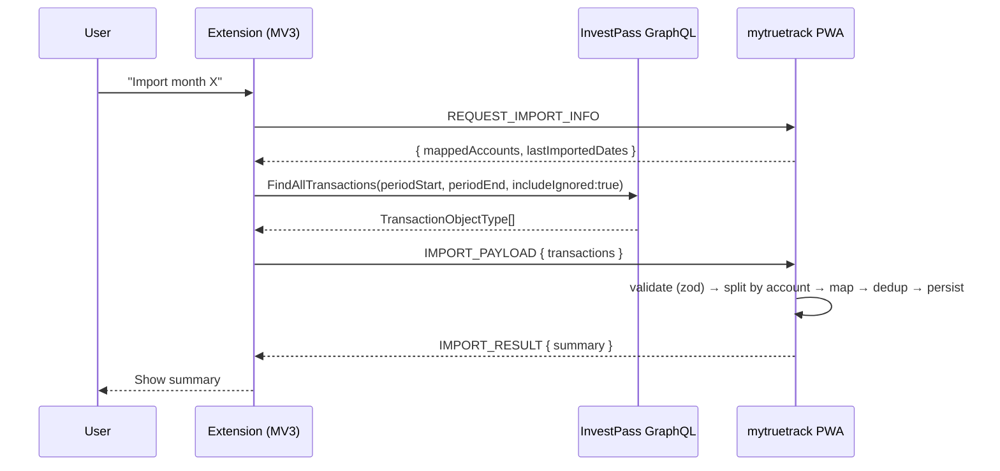

# InvestPass Import Design

**Spec**: `.specs/features/investpass-import/spec.md`
**Status**: Draft

---

## Architecture Overview

Two cooperating artifacts: a **Chromium MV3 browser extension** (the "acquirer") and the
**mytruetrack PWA** (the "importer"). The extension talks to InvestPass's GraphQL API using
the user's in-session JWT, then hands the structured data to the PWA over a private messaging
bridge. The PWA maps accounts, converts types, deduplicates, and persists under the unlocked
vault.



---

## Design Spike Results (2026-06-28)

### FindAllTransactions — Confirmed

```graphql
query FindAllTransactions($filters: FindAllTransactionsFilter) {
  findAllTransactions(filters: $filters) {
    id            # UUID (stable dedup key) ✅
    name          # description string
    date          # ISO-8601 UTC datetime
    amount        # Float — ALWAYS POSITIVE (sign is in `type`)
    type          # "DEBIT" | "CREDIT"
    ignored       # Boolean (import all regardless)
    category {
      name
      icon
      color
    }
    account {
      name        # routing key (= "Conta")
      institution {
        name
        iconImageSrc
      }
    }
  }
}
```

**Variables:**
```json
{
  "filters": {
    "periodStartDate": "2026-05-01T03:00:00.000Z",
    "periodEndDate": "2026-06-01T02:59:59.999Z",
    "includeIgnored": true
  }
}
```

### Key differences from CSV (spec corrections)

| Aspect | CSV export | GraphQL API |
| ------ | ---------- | ----------- |
| Amount sign | Signed float (negative=debit) | **Always positive**; direction in `type` field |
| Type | Inferred from sign | Explicit enum `"DEBIT"` / `"CREDIT"` |
| Period filter | Client-side (full dataset loaded) | **Server-side** (filter in variables) |
| Timezone in filter | N/A | Frontend sends local midnight as UTC offset (e.g. `T03:00:00.000Z` = midnight BRT) |
| Account | `Conta` column (plain name) | `account.name` + `account.institution.name` |
| Transaction ID | None | UUID `id` field |

### Conversion rule (updated from spec)

The spec said "negative Valor→debit, positive→credit" — this applies only to the CSV fallback.
For GraphQL: map `type` directly (`"DEBIT"→'debit'`, `"CREDIT"→'credit'`); `amount` is already
the absolute value → convert to integer cents (`Math.round(amount * 100)`).

---

## Code Reuse Analysis

### Existing Components to Leverage

| Component | Location | How to Use |
| --------- | -------- | ---------- |
| `importTransactions` | `src/workers/import-service.ts` | Feed `ParsedTransaction[]` with `externalId` = InvestPass UUID; handles dedup + persist |
| `ParsedTransaction` type | `src/workers/types.ts` | Target shape for conversion |
| Import-mappings store | `src/storage/import-mappings.ts` | Pattern for the new account-map IndexedDB store (same idb library, same structure) |
| Transaction repository | `src/storage/repositories/transaction-repository.ts` | Used internally by import-service |
| Vault gate | `src/app/vault-gate.tsx` | Ensures DEK is available before import |
| `createTransaction` domain | `src/domain/transaction.ts` | Validation during import |

### Integration Points

| System | Integration Method |
| ------ | ------------------ |
| InvestPass GraphQL | Extension content-script calls API with in-session Bearer JWT |
| PWA import pipeline | Extension sends `ParsedTransaction[]`-shaped data over bridge; PWA feeds `importTransactions()` |
| Account mapping store | New IndexedDB store; PWA reads/writes; extension queries via bridge message |
| Vault | Import blocked when locked (existing `vault-gate.tsx` pattern) |

---

## Bridge Mechanism: `externally_connectable`

**Choice**: Chrome `externally_connectable` with `chrome.runtime.sendMessage` from the PWA
to the extension, and `chrome.runtime.onMessageExternal` in the extension's service worker.

**Why not `postMessage` via content script?**
- Content scripts inject into *every matching page* — attack surface.
- `postMessage` is broadcast; requires manual origin checking.
- `externally_connectable` is Chrome's built-in, origin-verified, point-to-point channel.
  The extension declares which origins may talk to it; Chrome enforces it at the platform level.

**Extension `manifest.json` (relevant excerpt):**
```json
{
  "manifest_version": 3,
  "externally_connectable": {
    "matches": ["https://localhost:*/*", "http://localhost:*/*"]
  },
  "permissions": ["cookies"],
  "host_permissions": ["https://pass-api.invest-pass.com/*", "https://app.invest-pass.com/*"]
}
```

The PWA's deployed origin is added to `matches` at install/build time. In dev, `localhost` suffices.

**Security guarantees (IPIMP-08):**
1. Chrome verifies the sender's origin against `externally_connectable.matches` — no spoofing.
2. The extension checks `sender.origin` in the listener as defense-in-depth.
3. Payload is zod-validated at the PWA boundary (IPIMP-02).
4. No secrets cross the bridge — only structured transaction data.

**Direction of communication:**
- PWA → Extension: `chrome.runtime.sendMessage(extensionId, message)` (PWA initiates)
- Extension → PWA: response via the same `sendResponse` callback (request/response pattern)

For the import flow where the extension needs to push data *to* the PWA, we use a
**long-lived port** (`chrome.runtime.connect` from PWA, `onConnectExternal` in extension).
The port stays open during the import session; the extension pushes the payload when ready.

---

## Components

### 1. Extension: Service Worker (`background.ts`)

- **Purpose**: Orchestrates GraphQL fetch, token refresh, and bridge communication.
- **Location**: `extension/src/background.ts`
- **Interfaces**:
  - Listens on `chrome.runtime.onConnectExternal` for PWA connections.
  - Message types: `REQUEST_IMPORT_INFO`, `START_IMPORT`, `IMPORT_PAYLOAD`, `IMPORT_RESULT`.
  - Calls `fetchTransactions(token, periodStart, periodEnd)`.
- **Dependencies**: InvestPass session (Bearer JWT from cookie/storage), `chrome.cookies` API.
- **Reuses**: Nothing existing (new artifact).

### 2. Extension: Token Acquisition

- **Purpose**: Read the Bearer JWT from the InvestPass session. The extension has
  `host_permissions` on `app.invest-pass.com` and `pass-api.invest-pass.com`, so it can
  read cookies or execute a `RefreshToken` mutation.
- **Strategy**: On import start, execute the `RefreshToken` GraphQL mutation (observed in
  network — no auth header needed, just the `refresh_token_v2` cookie which Chrome sends
  automatically for `pass-api.invest-pass.com` since the extension has host permission +
  `credentials: 'include'`). This gives a fresh ~15min access token.
- **Location**: `extension/src/investpass-api.ts`

### 3. Extension: GraphQL Client (`investpass-api.ts`)

- **Purpose**: Call `FindAllTransactions` and `FindAllCategories`.
- **Location**: `extension/src/investpass-api.ts`
- **Interfaces**:
  ```typescript
  type InvestPassTransaction = {
    id: string;          // UUID
    name: string;
    date: string;        // ISO-8601 UTC
    amount: number;      // always positive
    type: 'DEBIT' | 'CREDIT';
    ignored: boolean;
    category: { name: string; icon: string; color: string } | null;
    account: { name: string; institution: { name: string } };
  };

  function refreshToken(): Promise<string>;
  function fetchTransactions(
    token: string,
    periodStart: string,   // ISO-8601 UTC
    periodEnd: string,
  ): Promise<InvestPassTransaction[]>;
  ```
- **Dependencies**: `fetch` (service workers have it natively).

### 4. Extension: Popup UI (`popup.html` / `popup.tsx`)

- **Purpose**: Period picker (month/range) + status display + import summary.
- **Location**: `extension/src/popup/`
- **Interfaces**: User selects month → extension sends `START_IMPORT` to service worker.
- **Dependencies**: Preact or vanilla (keep bundle tiny; not full React).

### 5. PWA: Bridge Client (`src/sync/investpass-bridge.ts`)

- **Purpose**: Communicate with the companion extension via `chrome.runtime.connect`.
- **Location**: `src/sync/investpass-bridge.ts` (or `src/ui/hooks/useInvestPassImport.ts`)
- **Interfaces**:
  ```typescript
  type BridgeMessage =
    | { type: 'REQUEST_IMPORT_INFO' }
    | { type: 'IMPORT_INFO'; accounts: AccountMapEntry[]; lastDates: Record<string, string> }
    | { type: 'START_IMPORT'; periodStart: string; periodEnd: string }
    | { type: 'IMPORT_PAYLOAD'; transactions: InvestPassTransaction[] }
    | { type: 'IMPORT_RESULT'; summary: ImportSummary };

  function connectToExtension(extensionId: string): Port | null;
  function isExtensionAvailable(extensionId: string): Promise<boolean>;
  ```
- **Dependencies**: `chrome.runtime.connect` (available in page context when extension declares `externally_connectable`).
- **Reuses**: Pattern from `src/sync/active-provider.ts` (async init, fallback).

### 6. PWA: Account Mapping Store (`src/storage/investpass-account-map.ts`)

- **Purpose**: Persist InvestPass `account.name` → mytruetrack `accountId` bindings.
- **Location**: `src/storage/investpass-account-map.ts`
- **Interfaces**:
  ```typescript
  type AccountMapEntry = {
    investPassAccountName: string;
    mytruetrackAccountId: string;
    lastImportedDate: string | null;  // YYYY-MM-DD, for incremental (P2)
  };

  function getAccountMap(): Promise<AccountMapEntry[]>;
  function getMapping(investPassName: string): Promise<AccountMapEntry | undefined>;
  function saveMapping(entry: AccountMapEntry): Promise<void>;
  function updateLastImportedDate(investPassName: string, date: string): Promise<void>;
  function deleteMapping(investPassName: string): Promise<void>;
  ```
- **Dependencies**: `idb` library (already in project).
- **Reuses**: Pattern from `src/storage/import-mappings.ts`.

### 7. PWA: InvestPass Import Processor (`src/workers/investpass-import.ts`)

- **Purpose**: Convert `InvestPassTransaction[]` → `ParsedTransaction[]`, split by account,
  and feed each slice to `importTransactions()`.
- **Location**: `src/workers/investpass-import.ts`
- **Interfaces**:
  ```typescript
  type InvestPassImportResult = {
    perAccount: Record<string, ImportResult>;
    unmappedAccounts: string[];
  };

  function processInvestPassImport(
    db: Database,
    transactions: InvestPassTransaction[],
    accountMap: AccountMapEntry[],
  ): Promise<InvestPassImportResult>;
  ```
- **Conversion logic** (per transaction):
  1. `type`: `"DEBIT"` → `'debit'`, `"CREDIT"` → `'credit'`
  2. `amount`: `Math.round(transaction.amount * 100)` → integer cents (Money)
  3. `date`: parse ISO UTC → convert to `America/São_Paulo` → format `YYYY-MM-DD`
  4. `description`: `transaction.name`
  5. `externalId`: `transaction.id` (UUID)
  6. Route by `transaction.account.name` → look up `accountMap` → get `mytruetrackAccountId`
- **Dependencies**: `importTransactions` from `import-service.ts`, `Intl.DateTimeFormat` for timezone.
- **Reuses**: `import-service.ts` (dedup + persist), `ParsedTransaction` type.

### 8. PWA: Import UI — InvestPass Page (`src/ui/pages/InvestPassImportPage.tsx`)

- **Purpose**: UI for the InvestPass import flow: extension connection status, period
  selection (if not delegated to extension popup), account mapping prompts, import progress,
  summary display.
- **Location**: `src/ui/pages/InvestPassImportPage.tsx`
- **Dependencies**: `useInvestPassImport` hook, account-map store, vault context.

---

## Data Models

### Account Map (IndexedDB)

```typescript
type AccountMapEntry = {
  /** InvestPass account name (e.g. "Cartão XP Visa Infinite") — the key. */
  investPassAccountName: string;
  /** mytruetrack account ID this maps to. */
  mytruetrackAccountId: string;
  /** Last imported transaction date (YYYY-MM-DD) for incremental detection (P2). */
  lastImportedDate: string | null;
};
```

**Store**: IndexedDB database `mytruetrack-investpass-map`, object store `account-map`,
keyPath `investPassAccountName`.

### Bridge Message Protocol

```typescript
/** Extension → PWA (or PWA → Extension) messages over the port. */
type BridgeMessage =
  | { type: 'PING' }
  | { type: 'PONG'; extensionVersion: string }
  | { type: 'REQUEST_IMPORT_INFO' }
  | { type: 'IMPORT_INFO'; mappedAccounts: AccountMapEntry[]; }
  | { type: 'START_IMPORT'; periodStart: string; periodEnd: string }
  | { type: 'IMPORT_PAYLOAD'; transactions: InvestPassTransaction[] }
  | { type: 'IMPORT_RESULT'; summary: InvestPassImportResult }
  | { type: 'ERROR'; code: string; message: string };
```

### InvestPass Transaction (zod-validated at bridge boundary)

```typescript
const InvestPassTransactionSchema = z.object({
  id: z.string().uuid(),
  name: z.string(),
  date: z.string().datetime(),
  amount: z.number().nonnegative(),
  type: z.enum(['DEBIT', 'CREDIT']),
  ignored: z.boolean(),
  category: z.object({
    name: z.string(),
    icon: z.string(),
    color: z.string(),
  }).nullable(),
  account: z.object({
    name: z.string(),
    institution: z.object({ name: z.string() }),
  }),
});

const ImportPayloadSchema = z.object({
  type: z.literal('IMPORT_PAYLOAD'),
  transactions: z.array(InvestPassTransactionSchema),
});
```

---

## Error Handling Strategy

| Error Scenario | Handling | User Impact |
| -------------- | -------- | ----------- |
| Extension not installed / not connectable | `chrome.runtime.connect` returns null or throws | UI shows "Install the companion extension" with instructions |
| InvestPass session expired (401) | Extension calls `RefreshToken`; if cookie gone → error | "Re-open InvestPass and retry" message |
| Bridge payload fails zod validation | Reject entire payload; log diagnostic | "Import failed: unexpected data format" |
| Unmapped account encountered | Hold those rows; prompt user to map | Mapping dialog before import proceeds |
| Individual transaction validation error | Collected in `errors[]`; import continues | Summary shows error count with details |
| Concurrent import attempt | Serialize via a lock (single `importing` flag) | "Import already in progress" toast |
| Vault locked | Block at UI level (vault-gate) | "Unlock your vault to import" |

---

## Risks & Concerns

| Concern | Location | Impact | Mitigation |
| ------- | -------- | ------ | ---------- |
| InvestPass API is private/undocumented; may change without notice | Extension GraphQL client | Import breaks | zod validation fails-closed; version the expected schema; surface clear "format changed" error |
| Bearer JWT ~15min expiry; large imports might timeout | Extension token handling | Partial fetch failure | Refresh token before each fetch; monthly granularity keeps payloads small (~100-200 txns) |
| `chrome.runtime.sendMessage` not available when extension is disabled/removed | PWA bridge client | Silent failure | Feature-detect with try/catch; show "extension not found" UI state |
| `amount` is float (e.g. 279.99) — floating-point cents conversion | Import processor | Off-by-one cent | Use `Math.round(amount * 100)`; add test cases for known edge values |
| `externally_connectable` requires knowing the extension ID at PWA build time | Bridge client | Can't connect if ID changes | Use a stable extension ID (set `key` in manifest for consistent ID); make ID configurable |
| InvestPass period filter uses UTC-offset midnight (T03:00:00.000Z for BRT) | Extension date logic | Wrong transactions if offset wrong | Extension computes filter dates the same way: local midnight → UTC |

---

## Tech Decisions

| Decision | Choice | Rationale |
| -------- | ------ | --------- |
| Bridge mechanism | `externally_connectable` + long-lived port | Platform-verified origin; no content-script injection; point-to-point; survives service-worker lifecycle |
| Extension UI framework | Preact (or vanilla) in popup | Tiny bundle; no React overhead for a simple period picker + summary |
| Transaction amount handling | `type` field for direction (not sign) | GraphQL API returns positive amounts + explicit type enum; cleaner than sign inference |
| Account map storage | Separate IndexedDB (not SQLite) | Unencrypted metadata (account names only); mirrors `import-mappings.ts` pattern; no CRDT needed |
| Date timezone conversion | `Intl.DateTimeFormat` with `timeZone: 'America/Sao_Paulo'` | No extra dependency; built-in; handles DST transitions |
| Period filter construction | Mirror InvestPass's own offset logic | Filter dates = local midnight as UTC (offset by -3h for BRT / -2h during DST) |
| Extension token strategy | Call `RefreshToken` mutation (cookie-authenticated) | Gets a fresh 15min JWT without storing credentials; cookie is HttpOnly + Secure, sent automatically by Chrome with host_permissions |

---

## Project-Level Decision (→ STATE.md)

**AD-009: Companion browser extension artifact + externally_connectable bridge**

The InvestPass import feature introduces a **Chromium Manifest V3 browser extension** as a new
build artifact. It communicates with the PWA via Chrome's `externally_connectable` API (origin-
verified, point-to-point messaging). The extension acquires data from third-party APIs using the
user's own session; it never writes to mytruetrack's encrypted database (only the PWA holds the
DEK). The extension is local/unpacked at launch; web-store publishing is deferred.

This is the first (and only planned) extension artifact. It does NOT set a precedent that every
integration needs an extension — it is justified here because the target API's auth tokens live
in a cross-origin cookie jar that only an extension with `host_permissions` can access.
