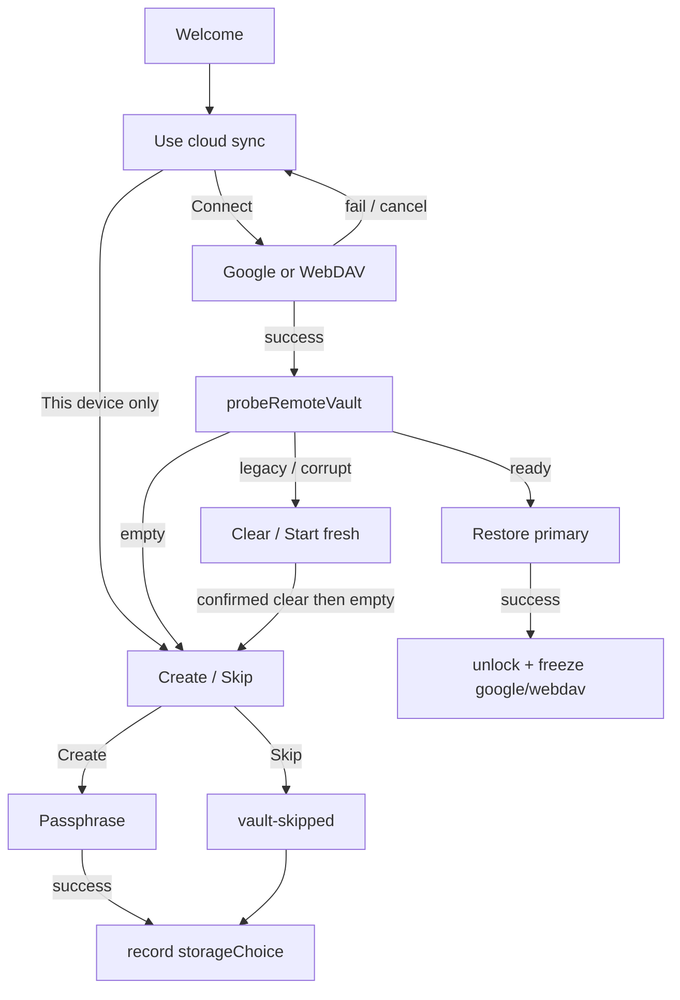

# Setup Sync-First Design

**Spec**: `.specs/features/setup-sync-first/spec.md`
**Context**: `.specs/features/setup-sync-first/context.md`
**Status**: Approved
**Approach**: Option 1 — Freeze record on `SyncConfig` + reorder SetupWizard

---

## Architecture approaches

All three deliver the same spec. Option 1 is the default unless you override.

| | Option 1 — Freeze on `SyncConfig` (recommended) | Option 2 — Setup state machine module | Option 3 — Route-per-step |
| --- | --- | --- | --- |
| What | Add `storageChoice` to the existing IndexedDB config. Reorder wizard steps. Strip Settings first-connect. Extract a tiny pure policy helper for Create/Restore/Skip. | Same freeze, plus a `setup-machine.ts` that owns every wizard transition without React. | Same freeze, but `/setup/sync`, `/setup/connect`, `/setup/vault` routes. |
| Pros | Fits AD-003/AD-010. Probe/restore stay put. Tests can cover freeze + policy without mounting the wizard. | Strongest SSF-01..05 unit tests. | Deep-linkable steps. |
| Cons | SetupWizard stays a large step component. | Extra abstraction for a linear wizard. | Router and VaultGate churn for no product gain. |

**Choice:** Option 1. The hole is order + freeze, not a missing workflow engine.

---

## Architecture Overview

Storage choice is recorded once when setup **completes** (Create, Restore, or Skip). Until then Google tokens may exist from a mid-setup Connect, but Settings is not on screen. After completion, Settings reads `storageChoice` and never offers another provider type.

`probeRemoteVault` / `restoreVaultFromRemote` / Clear / Start fresh stay as in AD-010. This feature only changes **when** they run and **where** Start fresh lands.



```text
Setup complete freeze
  Create / Restore / Skip success
    → storageChoice = 'google-drive' | 'webdav' | 'local-only'
    → Settings becomes read-only for provider type

Start fresh (confirmed)
  → if cloud provider: delete segments + vault-metadata.json
  → if remote still ready/legacy: stop, keep keys
  → clearKeyData + clearSyncConfig + clearSyncState + remove vault-skipped
  → sessionStorage setup-after-fresh = 'sync'
  → VaultProvider.reset → needs-setup
  → SetupWizard lands on Use cloud sync (not Create)

Existing installs (no storageChoice field)
  → provider google-drive | webdav → that choice
  → vault already ready and provider null → local-only
```

Conform to **AD-003** (no CloudProvider change) and **AD-010** (metadata probe/restore unchanged). **AD-010 Start fresh → Create** is replaced by Start fresh → Use cloud sync (AD-011).

---

## Code Reuse Analysis

### Existing Components to Leverage

| Component | Location | How to Use |
| --------- | -------- | ---------- |
| `probeRemoteVault` / `restoreVaultFromRemote` | `src/sync/vault-metadata.ts` | Unchanged; wizard calls them **after** Connect |
| `SetupWizard` connect-cloud + Restore UI | `src/ui/pages/SetupWizard.tsx` | Move Connect before vault choice; keep passphrase/recovery/biometric |
| `SyncSection` confirm dialogs | `src/ui/components/SyncSection.tsx` | Copy for Setup Clear / Start fresh; remove provider radios |
| `SyncConfig` / `loadSyncConfig` / `saveSyncConfig` | `src/sync/sync-config.ts` | Add `storageChoice`; migrate missing field |
| `connectGoogleDrive` / `isGoogleConfigured` | `src/sync/providers/google-auth-flow.ts` | Setup Connect + Settings Reconnect only |
| `resolveActiveProvider` | `src/sync/active-provider.ts` | Probe/push/pull; `local-only` never resolves a provider |
| `startFreshVault` / `clearCloudSyncData` | `src/sync/sync-engine.ts` | Extend: optional provider, clear sync config |
| `clearSyncConfig` / `clearSyncState` | `sync-config.ts` / `sync-state.ts` | Start fresh must unfreeze |
| `VaultProvider.reset` | `src/app/vault-provider.tsx` | After Start fresh, `needs-setup` |
| `createMockCloudProvider` | `src/sync/mock-cloud-provider.ts` | Policy + startFresh tests |

### Integration Points

| System | Integration Method |
| ------ | ------------------ |
| Onboarding | New `sync-choice` step after Welcome; freeze on completion |
| Settings | Read-only provider label; Reconnect / WebDAV credential retry; no radios |
| Auto-sync | Unchanged: no provider → no pull/push. Local-only freeze keeps `provider: null` |
| Full reset (`wipeEverything`) | Already clears sync config; next visit is sync-first setup |
| Cloud vault metadata | Probe/restore/clear/upsert unchanged |

---

## Components

### `storage-choice.ts` (new)

- **Purpose**: Pure helpers for freeze, migrate, and which vault actions the probe allows.
- **Location**: `src/sync/storage-choice.ts`
- **Interfaces**:
  - `StorageChoice = 'google-drive' | 'webdav' | 'local-only'`
  - `inferStorageChoice(config, ctx: { hasVault: boolean; skipped: boolean }): StorageChoice | null` — migrate pre-feature records
  - `vaultActionsForProbe(status: RemoteVaultStatus \| { kind: 'local-only' }): { create: boolean; restore: boolean; skip: boolean }`
- **Dependencies**: `RemoteVaultStatus` from `vault-metadata.ts`
- **Reuses**: Probe kinds already shipped

`vaultActionsForProbe` (SSF-03, SSF-06..09):

| Input | create | restore | skip |
| ----- | ------ | ------- | ---- |
| `local-only` | true | false | true |
| `empty` | true | false | true |
| `ready` | false | true | false |
| `legacy` | false | false | false |
| `corrupt` | false | false | false |

### `sync-config.ts` (extend)

- **Purpose**: Persist frozen choice beside provider tokens.
- **Changes**:
  - `SyncConfig.storageChoice: StorageChoice | null` (`null` = setup not completed)
  - `loadSyncConfig` returns `storageChoice` when present; does **not** infer (inference needs vault flags). Callers that need a freeze (Settings, VaultGate-adjacent) call `inferStorageChoice` and may persist it once.
  - `DEFAULT_CONFIG.storageChoice = null`
  - Existing records without the field load as `null` then get inferred
- **Reuses**: Same IDB database `mytruetrack-sync-config` (no version bump; extra JSON field)

### `startFreshVault` (extend)

- **Purpose**: Wipe vault identity and unfreeze storage so setup can choose again.
- **Location**: `src/sync/sync-engine.ts`
- **Interfaces**:
  - `startFreshVault(provider: CloudProvider | null): Promise<void>`
  - If `provider` is set: `clearCloudSyncData` first. On failure, throw and **do not** clear keys or config (existing test).
  - Then `clearKeyData`, `clearSyncConfig`, `clearSyncState`, `localStorage.removeItem('vault-skipped')`
- **Reuses**: Current remote-clear-then-keys order

### `SetupWizard.tsx` (reorder)

- **Purpose**: Sync choice before any DEK.
- **Steps**: `welcome` → `sync-choice` → `connect-cloud` (Connect only) → `choice` (Create/Restore/Skip) → existing `passphrase` / `restore` / `recovery` / `biometric` / `done`
- **Behavior**:
  - `setup-after-fresh === 'sync'` skips Welcome and opens `sync-choice`
  - This device only: go to `choice` with synthetic `local-only` actions; do not save `storageChoice` yet; if leftover tokens exist from a cancelled Connect, `saveSyncConfig(DEFAULT_CONFIG)` so This device only does not keep Drive
  - Connect: existing Google/WebDAV form; persist provider **without** `storageChoice`; probe; then `choice`
  - Cancel Connect: back to `sync-choice`; do not freeze; drop incomplete tokens (same DEFAULT_CONFIG)
  - Freeze `storageChoice` only in Create success, Restore success, and Skip
  - Clear / Start fresh on `choice`: Settings-style confirm; after successful Clear, re-probe; after successful Start fresh, `setStep('sync-choice')` (config already cleared)
- **Reuses**: Current connect-cloud, Restore, passphrase, `runProbe`

### `SyncSection.tsx` (strip first-connect)

- **Purpose**: Operate the frozen provider; never pick a new one.
- **Changes**:
  - Remove Cloud Provider radios (`none` / WebDAV / Drive)
  - `local-only`: read-only “This device only”; no Connect, no WebDAV form, no Push/Pull/Clear (no remote). **Start fresh** still shown
  - `google-drive`: read-only label; Reconnect when tokens missing/expired; Disconnect may clear tokens only (`google: null`, provider stays `google-drive`); no provider radio
  - `webdav`: endpoint + folder **read-only**; username/password editable; Test + Save credentials for that same endpoint only
  - Start fresh: `startFreshVault(providerOrNull)` then `sessionStorage setup-after-fresh = 'sync'` then `reset()`
- **Reuses**: Push/Pull/Clear/rename/known-devices when cloud

---

## Data Models

### `StorageChoice` / `SyncConfig`

```typescript
type StorageChoice = 'google-drive' | 'webdav' | 'local-only';

type SyncConfig = {
  readonly storageChoice: StorageChoice | null;
  readonly provider: SyncProviderType; // 'google-drive' | 'webdav' | null
  readonly webdav: WebDavConfig | null;
  readonly google: GoogleTokens | null;
};
```

**Relationships**: After freeze, `storageChoice === 'google-drive'` implies `provider === 'google-drive'` (tokens may be null). `storageChoice === 'local-only'` implies `provider === null`. `storageChoice === null` only during incomplete setup.

### Inference (existing origins)

```typescript
function inferStorageChoice(
  config: SyncConfig,
  ctx: { hasVault: boolean; skipped: boolean },
): StorageChoice | null {
  if (config.storageChoice) return config.storageChoice;
  if (config.provider === 'google-drive' || config.provider === 'webdav') return config.provider;
  if (ctx.hasVault || ctx.skipped) return 'local-only';
  return null;
}
```

---

## Error Handling Strategy

| Error Scenario | Handling | User Impact |
| -------------- | -------- | ----------- |
| Google/WebDAV connect fails or user cancels | Stay on Connect or return to sync-choice; no DEK; no `storageChoice` | Recoverable error / Back |
| Probe fails after Connect | Stay in setup; provider tokens may exist; no DEK | Error + retry probe |
| Restore wrong passphrase | Unchanged AD-010 | Error; stay on Restore |
| Clear / Start fresh remote failure | Do not clear keys/config; do not jump to Create | Error; still `ready`/`legacy` |
| Google Reconnect fails | Keep `storageChoice: 'google-drive'`; tokens stay empty | Reconnect again; no WebDAV switch |
| WebDAV retry auth fails | Keep frozen endpoint/folder | Error on Test; credentials stay editable |

---

## Risks & Concerns

| Concern | Location | Impact | Mitigation |
| ------- | -------- | ------ | ---------- |
| Create before Connect | `SetupWizard.tsx` choice step | Same decrypt failure after wipe | `sync-choice` before `choice`; SSF-02 no `generateDek` until after choice |
| Settings provider radios | `SyncSection.tsx:433-456` | First-connect after a local DEK | Remove radios; render from `storageChoice` only |
| `startFreshVault` requires a provider | `sync-engine.ts:97` | Local-only cannot Start fresh without inventing a cloud | Allow `provider: null`; skip remote delete |
| Start fresh jumps to Create | `SyncSection.tsx:360` `setup-after-fresh=create` | Recreates the hole | Key becomes `'sync'`; wizard opens `sync-choice` |
| Start fresh leaves sync config | `startFreshVault` today | Next setup still “has Drive” | Clear sync config + sync state after successful remote clear |
| Missing `storageChoice` on existing users | `sync-config.ts` | Settings would look unfrozen | `inferStorageChoice` + persist once when app is ready |
| SetupWizard size / no component tests | `SetupWizard.tsx` ~750 lines | UI regressions on SSF-01..11 | Unit-test `vaultActionsForProbe` and freeze/infer; e2e covers the wizard path if present, else manual UAT |
| `handleConnectGoogle` in Settings | `SyncSection.tsx:109` | Could still first-connect if radios leak | Button only when `storageChoice === 'google-drive'` |
| WebDAV Save currently writes full config | `SyncSection.tsx` `handleSave` | Could change endpoint | Save credentials only; endpoint/folder disabled inputs |

---

## Tech Decisions

| Decision | Choice | Rationale |
| -------- | ------ | --------- |
| Architecture | Option 1: `storageChoice` on SyncConfig | Least surface; AD-003/AD-010 intact |
| When to freeze | On setup **completion** (Create, Restore, Skip), not on clicking This device only / Connect | Refresh mid-wizard can choose again; Settings never mounts mid-setup |
| Connect vs local leftover tokens | This device only and Connect cancel write `DEFAULT_CONFIG` | Avoids a hidden Drive attach |
| Google vs WebDAV UI | One Connect screen with radios (existing connect-cloud) | Agent discretion; already built |
| Start fresh landing | `setup-after-fresh=sync` → `sync-choice` | Spec SSF-17; supersedes CVM Create jump |
| Settings Disconnect | Token-only; provider type stays | Reconnect path; not a provider change |
| IDB version | No bump | Extra field on the same config object |
| Project-level | **AD-011** storage choice is frozen at setup | Future export/import must not re-open Settings first-connect |

---

## Requirement Mapping (design coverage)

| IDs | Design element |
| --- | -------------- |
| SSF-01, SSF-02 | Wizard `welcome` → `sync-choice` before passphrase; no `generateDek` until after choice |
| SSF-03 | `vaultActionsForProbe({ kind: 'local-only' })`; no connect prompt |
| SSF-04, SSF-05 | `connect-cloud` then probe; errors stay in setup |
| SSF-06..SSF-10 | `vaultActionsForProbe` + existing probe kinds |
| SSF-11 | Setup confirm dialogs before Clear / Start fresh |
| SSF-12..SSF-16 | SyncSection read-only from `storageChoice`; Reconnect / WebDAV credential retry |
| SSF-17..SSF-20 | `startFreshVault(null \| provider)` + `setup-after-fresh=sync`; fail closed if remote still `ready`/`legacy` |
